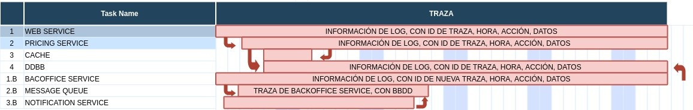
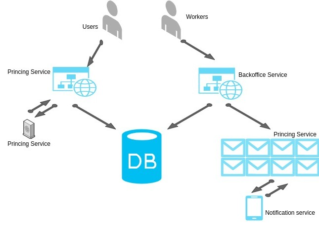

<h2>1. DESPLIEGUE PARA CADA SERVICIO Y VENTAJAS</h2>

Al tener un entorno basado en microservicios, mi solución seria utilizar CI/CD para poder automatizar la gran mayoría de los despliegues o acciones repetitivas. Esto nos ayudará a minimizar posibles errores humanos. 
Con este método podremos configurar upgrades, ejecuciones de pipelines o modificaciones automáticas guardando versiones anterior, para que en el caso de error en el despliegue o que el cambio no funcione de la manera esperada, podemos hacer rollback los más automatizado posible.

Para el caso de la BBDD, proponemos desploys manuales, siempre en el caso que tengamos que realizar modificaciones en la configuración. EL cambio solo irá adelante, siempre y cuando tengamos backup

<h2>2. SLOs PARA VERIFICAR FUNCIONAMIENTO PRICING ES CORRECTO</h2>

<ul>
<li>Disponibilidad: Establecer cuanto tiempo de disponibilidad tiene nuestro servicio o app.</li>
<li>Error badget: En la oferta del servicio, se firma con cliente el tiempo que puede estar el servicio fallando. Este SLO se refiere al % que nos queda por fallar. Contra más ajustado sea el error badged al final de año mejor debería ser la oferta, pero a la vez nos puede hacer superar ese tiempo de downtime y penalizar los SLAs. Por ese motivo debemos conocer bien el servicio, establecer unas buenas estadísticas de la misma y ser precavido con las nuevas funcionalidades. De esta forma podremos definir y ajustar coste, estabilidad y fallidas.</li>
<li>Burn rate: Nos sirve para saber a que velocidad se nos agota el error badget, es decir, el tiempo de dowtime que nos queda por consumir</li>
</ul>

<h2>3. EJEMPLO DE TRAZA DE PETICIÓN PARA ENVIO</h2>

Adjutnamos imagenes de un ejemplo del camino que debe seguir la traza

 

<h2>4. RESILENCIA WEB SERVICE CON PICO DE TRÁFICO</h2>

El método de resilencia que utilizaría en este caso seria Adaptive LIFO + CODEL. Con este proceso, evitaremos que se agrande el cuello de botella y daremos prioridad a los últimos accesos o la ultimas peticiones de la cola. Mientras los que han padecido el cuello de botella están recargando, el sistema en lugar de esperarles y agrandar la problemática con las siguientes peticiones, lo que hará será como he comentado dar prioridad a las nuevas requests, permitiendo que el sistema siga funcionando sin dar errores y reduciendo la saturación. 

También indicar que el servicio debería tener una alta disponibilidad si se preveen posibles cuellos de botella. Es decir, podemos configurar la creación de recursos (en este caso frontales) de manera automática en las franjas horarias con mayor número de peticiones

<h2>5. PROCESO CAÍDA DE SERVICIO EN COLA DE MENSAJES</h2>

El proceso para gestionar la caída debería ser el siguiente:

<ol>
<li>Se debería iniciar con una alerta en nuestro sistema de monitorización.</li>
<li>Apertura de incidencia de forma automática o por el operador que monitoriza.</li>
<li>La alerta vendría con un troobleshoting o disaster recovery a seguir para una 1a actuación por parte del nivel 1.</li>
<li>Si nivel 1 no puede solventarla, en als instrucciones se deberá especificar el correcto escalado y si es o no necesario la llamada a guardia en fuera de horario.</li>
<li>Recepción de la incidencia por parte del administrador, el cual seguirá el procedimiento establecido si lo hay.</li>
<li>En el caso que el administrador detecte corte o degradación del servicio, notificar a cliente indicando la severity del incident para establecer el SLA.</li>
<li>Informar a cliente de la resolución (procesos seguidos, si ha sido necesario restore o rollback) y a 1er nivel para asegurarse que la alerta recupera.</li>
<li>Si la incidencia ha provocado corte, se realizará el Incident Report, donde se expondrá el proceso que se ha seguido desde que ha salido la alerta hasta su resolución, con tiempos de cada paso. De esta forma veremos si se ha tardado más de la cuenta en algún para y establecemos posibles soluciones, tanto del proceso como para que no vuelva a suceder la incidencia.</li>
<li>También se puede realizar un informe Postmorten, si el corte así lo necesita. Informando del problema, el workaround y un estudio de mejora o de solución definitiva de la problemática.</li>
